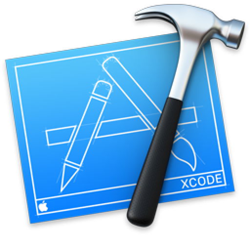

### Hi there 👋
### This is Ahmad Arbash's Profile I'm a software engineer | Flutter Developer
- 🔭 I’m currently working as Application Support at SARC NGO | Freelance Flutter Developer
- 🌱 I’m currently learning Flutter's advanced concepts and animations and the basics of the Backend with Node.js
- My best project is [Gameaway](https://play.google.com/store/apps/details?id=com.aplustechnologies.gameaway)
- 👯 I'm looking for a job as a Flutter Developer
# Contact me: 🤝

# Languages and tools: 🤝
            

<!--
**AHMADARBASH/AHMADARBASH** is a ✨ _special_ ✨ repository because its `README.md` (this file) appears on your GitHub profile.

Here are some ideas to get you started:

- 🔭 I’m currently working on ...
- 🌱 I’m currently learning ...
- 👯 I’m looking to collaborate on ...
- 🤔 I’m looking for help with ...
- 💬 Ask me about ...
- 📫 How to reach me: ...
- 😄 Pronouns: ...
- ⚡ Fun fact: ...
-->
